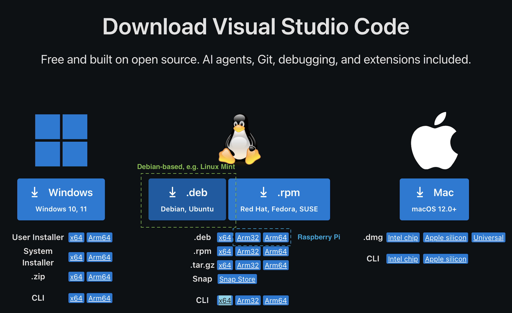
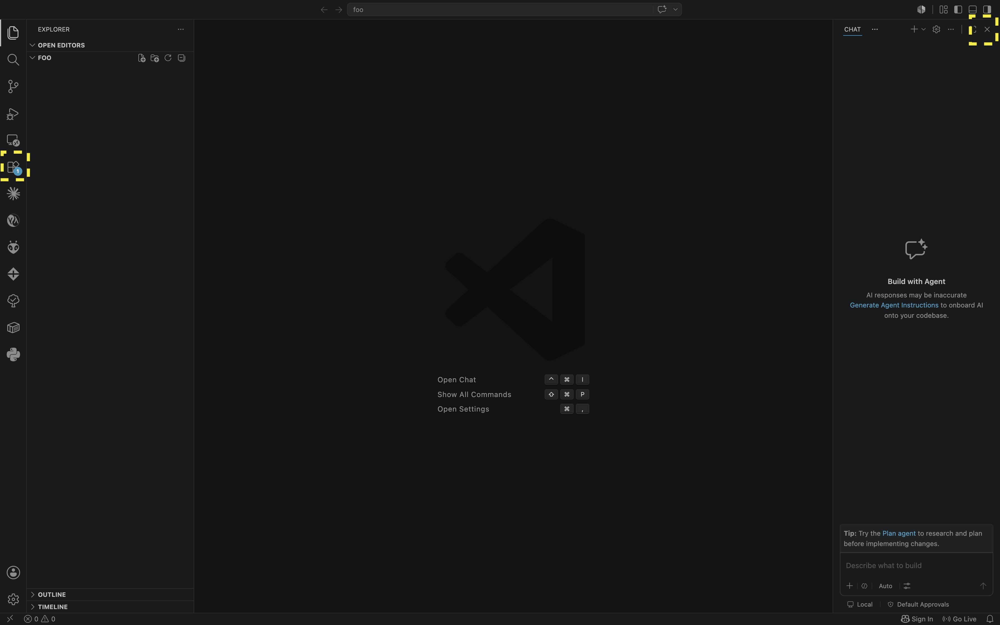
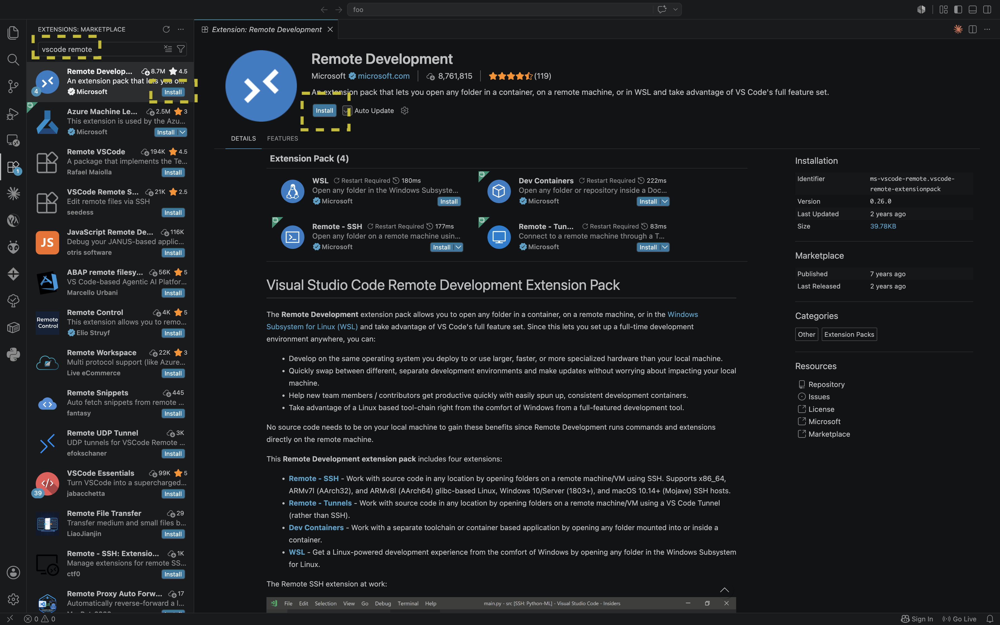
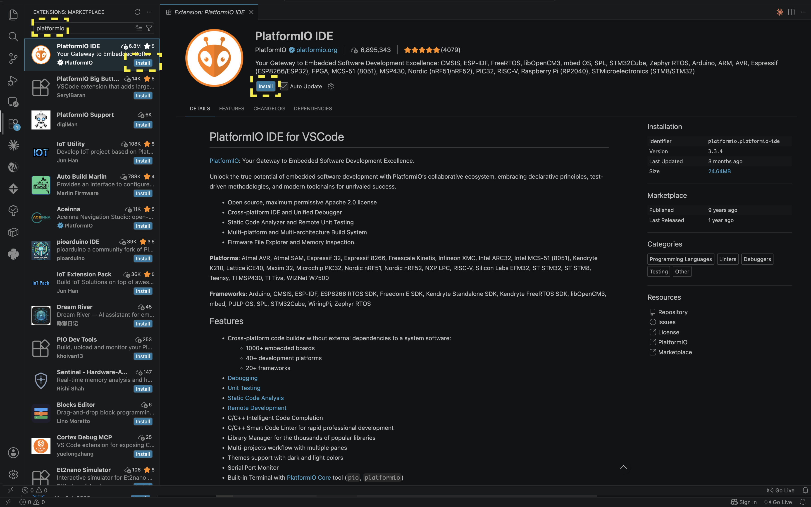

# VSCode and PlatformIO

Before you attempt this download, make sure you understand the difference between a client and a server. This IDE is meant to be installed on the client computer (typically a laptop), VSCode remote takes care of the remote IDE server setups.

Note: Your device can be both (client/server), e.g. a laptop you can remote into to do code development, and/or also be used for local code development.

<!-- TODO: write about what VScode is about  -->

## Installing VSCode

This install method assumes you have a GUI.

1. Get the installer from <https://code.visualstudio.com/download>.

    Choose the `.deb` package and verify the architecture matches:

    - x64 -> for Intel-based laptops
    - arm64 -> for modern raspberry pis (3/4/5)
    - arm32 -> for legacy raspberry pis (2/3)
    - .dmg -> MacOS
    > Note: MacOS is a certified UNIX which is in the same ecosystem as Linux.


    

    And then run:
    ```
    sudo dpkg -i ~/Downloads/code_*.deb
    ```
    > Note: `code_*.deb` is wildcard matching, it works as long as this code naming convention stays.

1. Launch it:

    You can open a terminal and type:
    ```
    code .
    ```
    > Tip: `code .` opens the current directory.

    or press the super button (windows key) and search for vscode, both works and you should see the glorious but empty IDE window pop up

    

    On the left hand side are where your extensions will live, and on the right is Copilot, that AI assist tool that comes pre-packaged with VSCode (sigh) and will start giving AI code assist prompts as soon as you link your github account to VSCode.

    **Note**: This Copilot feature has been hit by many security breaches since its inception (https://nvd.nist.gov/vuln/detail/cve-2025-53773) and still carries inherent risk to this day (June, 2026). Allowing any AI agents to run commands locally is a bad, bad idea. Do not link your github account to the feature!

## Installing useful Extensions

### [Remote Development](https://marketplace.visualstudio.com/items?itemName=ms-vscode-remote.vscode-remote-extensionpack)

1. Type "VScode remote" into the search bar and click the blue install button. The IDE takes care of the rest (hopefully).

    

    or 

    you could run install commands like a champ. 
    ```
    code --install-extension ms-vscode-remote.vscode-remote-extensionpack
    ```
    > Tip: You can find the unique identifiers on the top right hand side of the extension page, seen here as *ms-vscode-remote.vscode-remote-extensionpack*.

### [PlatformIO](https://marketplace.visualstudio.com/items?itemName=platformio.platformio-ide)

1. Type "platformio" into the search bar and click the blue install button. The IDE takes care of the rest.

    

    or 

    ```
    code --install-extension platformio.platformio-ide
    ```

1. Install [PlatformIO Core CLI](https://docs.platformio.org/en/latest/core/installation/index.html)

    While using the PlatformIO GUI was fun while I was starting out, the CLI tools (known here as "core") were limited to the CLI within the VSCode IDE, ie you could not use `pio` upon remoting in via `ssh` for instance. I found this to be incredibly limiting but thankfully there are installer scripts and a way forward - with some elbow grease.

    There are some instructions online here:
    <https://docs.platformio.org/en/latest/core/installation/methods/installer-script.html>
    
    But it might be better for me to just lead you along because it is easy to get lost, and frustrated with this install process.

    Let's start by using the 'super-quick' install scripts provided by PlatformIO:
    ```
    curl -fsSL -o get-platformio.py https://raw.githubusercontent.com/platformio/platformio-core-installer/master/get-platformio.py
    python3 get-platformio.py
    ```
    > Note: this downloads and then executes the python script in two separate commands, python3 just refers to running the script with the modern version of the python interpreter.

    remove the file after you are done:
    ```
    rm get-platformio.py
    ```

    Okay here is where it gets confusing, although it has been 'installed', your CLI does not know where to find the executables for the `pio` command. This is a common step for Linux toolchain installations, where you get a choice of adding this one-line to `.profile`, `.bashrc` or others. There are differences, read up [here](https://serverfault.com/questions/261802/what-are-the-functional-differences-between-profile-bash-profile-and-bashrc) but it is mind-boggling for beginners so ignore it for now if you want to keep your mind light.
    ```
    echo 'export PATH=$PATH:$HOME/.local/bin' >> ~/.profile
    ```

    Then create symlinks to the executables located in the `penv` virtual environment folder in `~/.platformio/penv` - remember symlinks are just redirects to executables/files/folders from another place:
    ```
    mkdir -p ~/.local/bin    # in case it doesn't exist yet
    ln -s ~/.platformio/penv/bin/platformio ~/.local/bin/platformio
    ln -s ~/.platformio/penv/bin/pio ~/.local/bin/pio
    ln -s ~/.platformio/penv/bin/piodebuggdb ~/.local/bin/piodebuggdb
    ```

    Finally, the terminal does not know these latest changes yet, let us gently instruct the CLI to refer to these new changes:
    ```
    source ~/.profile
    ```
    > Note: Logging out or rebooting apply these changes automatically too.

    Then type:
    ```
    pio --version
    ```

    and it should return like this for a successful installation:
    ```
    PlatformIO Core, version 6.1.19
    ```

    `pio` still needs some hardware permissions to be able to read devices on your serial interfaces (USB). To do that we need to explicitly grant permissions via `udev` rules. Do remember this because there are some other fancy IFTTT things we can do upon specified device plugins, but for now let's just recite the incantations:
    ```
    curl -fsSL https://raw.githubusercontent.com/platformio/platformio-core/develop/platformio/assets/system/99-platformio-udev.rules | sudo tee /etc/udev/rules.d/99-platformio-udev.rules
    ```
    > Note: This downloads the udev rules from platformio's github page and copies the file to its rightful place on your system.

    Restart the `udev` management tool:
    ```
    sudo service udev restart

    # or

    sudo udevadm control --reload-rules
    sudo udevadm trigger
    ```
    > Note: udev only works on plug-in/plug-out events. If this is not working, re-connect your serial device (e.g. microcontroller).

    and add the current user to the `dialout` group (to access serial devices)
    ```
    sudo usermod -aG dialout $USER
    ```
    > Tip: use `newgrp dialout` to relogin to apply changes quickly. use `groups` to check if `dialout` is now added to the list.


    Phew! That was tough! But you now have VSCode + Platformio + Remote Development! That's some industry-grade development environment supercharging your hobbyist projects :)


## Installing VSCode without a GUI (SKIP, if done already)

1. Get the installer from <https://code.visualstudio.com/download>.

    CLI (choose accordingly):
    ```
    wget --trust-server-names -P ~/Downloads "https://update.code.visualstudio.com/latest/linux-deb-x64/stable"
    sudo dpkg -i ~/Downloads/code_*.deb
    ```

    ```
    wget --trust-server-names -P ~/Downloads "https://code.visualstudio.com/sha/download?build=stable&os=linux-deb-arm64"
    sudo dpkg -i ~/Downloads/code_*.deb
    ```
    After this point `code` is now added to your system's apt sources and you can update it by

    ```
    sudo apt update
    sudo apt install --only-upgrade code
    ```

    You can also check if its updatable by way of:
    ```
    apt policy code
    ```
