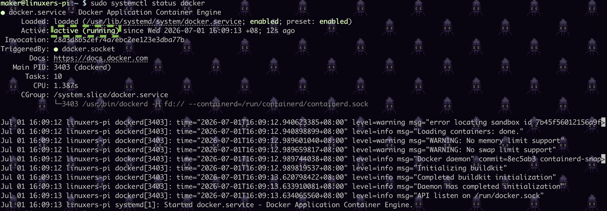

# Installing Docker

## via convenience script
1. Get and install latest stable version:
    ```
    curl -fsSL https://get.docker.com -o get-docker.sh
    sudo sh get-docker.sh
    rm get-docker.sh
    ```

1. add user to docker usergroup
    ```
    sudo usermod -aG docker $USER
    newgrp docker
    ```

1. test docker run:
    ```
    docker run hello-world
    ```
    Post-installation steps are explained [below](#Post-installation-steps).

## via APT (super-simple)
Note that Installation on Ubuntu derivative distributions, such as Linux Mint, is not officially supported (though it may work). 
The other caveat is that you will be a couple of minor versions behind -- `26.1.5` vs (as of time of writing)

1. Install ubuntu-managed docker `apt`:
    ```
    sudo apt-get install -y docker.io
    ```
    ```
    sudo usermod -aG docker $USER
    newgrp docker
    ```

    ```
    docker run hello-world
    ```
    Post-installation steps are explained [below](#Post-installation-steps).


## The proper way (SKIP if you have completed installation)

Instructions here: https://docs.docker.com/engine/install/debian/

1. Delete old installations/packages:

    ```
    sudo apt remove $(dpkg --get-selections docker.io docker-compose docker-doc podman-docker containerd runc | cut -f1)
    ```
1. Set up Docker's apt repository.

    ```
    # Add Docker's official GPG key:
    sudo apt update
    sudo apt install ca-certificates curl
    sudo install -m 0755 -d /etc/apt/keyrings
    sudo curl -fsSL https://download.docker.com/linux/debian/gpg -o /etc/apt/keyrings/docker.asc
    sudo chmod a+r /etc/apt/keyrings/docker.asc
    ```
    ```
    # Add the repository to Apt sources:
    sudo tee /etc/apt/sources.list.d/docker.sources <<EOF
    Types: deb
    URIs: https://download.docker.com/linux/debian
    Suites: $(. /etc/os-release && echo "$VERSION_CODENAME")
    Components: stable
    Architectures: $(dpkg --print-architecture)
    Signed-By: /etc/apt/keyrings/docker.asc
    EOF

    sudo apt update
    ```

1. Install latest version:
    ```
     sudo apt install docker-ce docker-ce-cli containerd.io docker-buildx-plugin docker-compose-plugin
    ```

## Post-installation steps:

1. For 'sudo-less' `docker` commands:
    ```
    sudo usermod -aG docker $USER
    newgrp docker
    ```
    Note: `newgrp` is a bit of a hack to fork a new subshell so changes get 'updated'.

1. Test:
    ```
    docker run hello-world
    ```

1. Verify that `docker` is running:
    ```
    sudo systemctl status docker
    ```
    
    
1. If docker is not running, try:    
    ```
    sudo systemctl enable docker.service
    sudo systemctl enable containerd.service
    ```