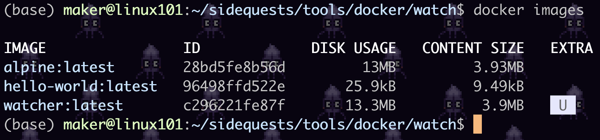
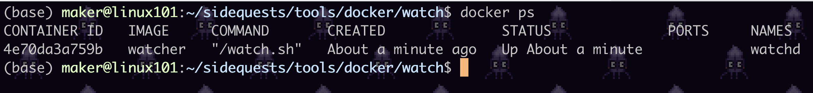
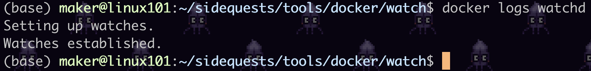
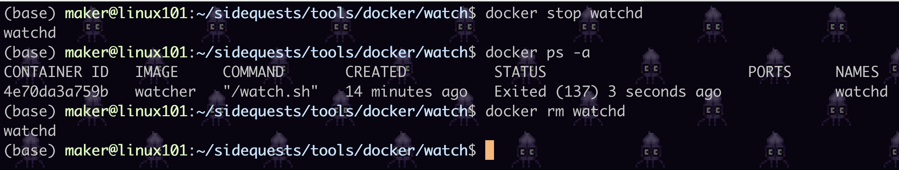
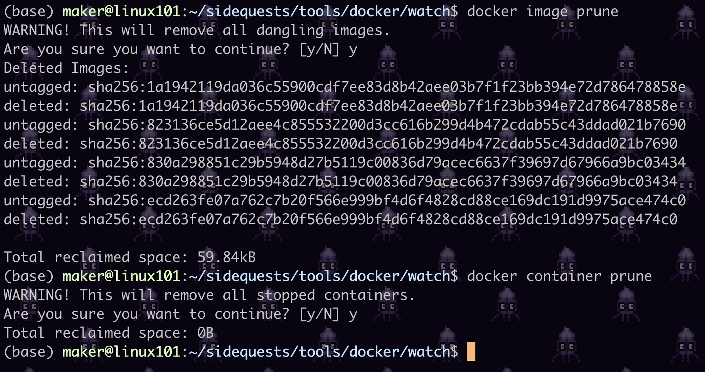

# Docker commands

Ahh... docker commands. These are worthwhile remembering because you will be typing these *alot*.

Here's a cheatsheet for convenience so your heads don't explode:


## Basic commands

1. `build` - builds the image
    ```
    docker build . -t watcher
    ```
    This commands builds the docker image as specified by the `Dockerfile`. You usually run this command in the same working directory as the Dockerfile hence `build .`

    Note: the `-t` tag <name-of-image>:<version>. If unnamed, <version> will be named "latest".

1. `image ls` - lists images
    ```
    docker image ls
    ```
    Use this to check if your images were built correctly. Check if your image tags were named correctly.

    

    Note: `docker images` works too!

1. `run` (with named containers)

    Now that your image is created, time to run it with the right image, here's the incantation:
    ```
    docker run -d --restart=unless-stopped --volume  files_to_watch:/files_to_watch --name watchd watcher    
    ```

    Let's take a pause and learn what these run flags are:  
    `-d` - detached mode.  
    `--restart=unless-stopped` - daemonizes container.  
    `--volume` - mounts/synchronizes a file directory/interface/port into the container.  
    `--name` - names your container, so its easier to refer to (we'll explain in `start/stop`)

    It is worthwhile to put this incantation into a bash script (see `run.sh`) and run that instead. Remember to `chmod +x`!

1. `ps`

    Check your container is running correctly:
    ```
    docker ps
    ```
    

    Note: You can also refer to the container (instead of name) by the `CONTAINER ID`. Just type the first few characters like `4e7` in this case. Docker infers the rest! This is how we refer to containers that are unnamed.

1. `logs`

    Let's read the logs from the container:
    ```
    docker logs watchd
    ```
    

    This spits out the logs from the container's creation to now, but it's not real-time!

    Far more useful are logs that update, do this with the follow (`-f`) option:
    ```
    docker logs -f watchd
    ```
    That way, when a file comes in you are notified. Press `ctr-c` to escape.  
    Note: replace `watchd` with the name of your container.

    ---

    Activity time! 
    
    Try putting some files into the `files_to_watch` folder while checking logs. Tell us what happens.


1. `stop/start`
    
    Sometimes you have a need to stop the container. For example, when the printer is out of paper (oops!) or you do not want the container to run anymore, but stay idle:
    ```
    docker stop watchd
    ```
    Note: replace `watchd` with the name of your container.

1. `rm`

    Finally when containers are stopped, they do not remove themselves (unless you use the `--rm` flag). Look for these stopped/hidden containers by running:
    ```
    docker ps -a
    ```
    and removing the hidden/stopped containers:
    ```
    docker rm watchd
    ```
    


1. `prune`

    Pruning (ie cleaning) is important to free up memory on your system. You can prune stopped containers, unused images and unused volumes (advanced topic). If you are lazy, you can use the nuclear `system prune` that does all these 3 at once.

    ```
    docker container prune
    ```
    

    As you can see, this is especially true for images, can take up GBs of space

## Stretch goals
- [] demo on other OS platforms
- [] demo auto-start on system boot
- [] docker image push

# Next week 
- Dockerfile
    - FROM
    - USE
    - COPY
    - ENTRYPOINT
    - CMD
    - EXTRA: EXPOSE/VOLUME

- Compose and orchestration


